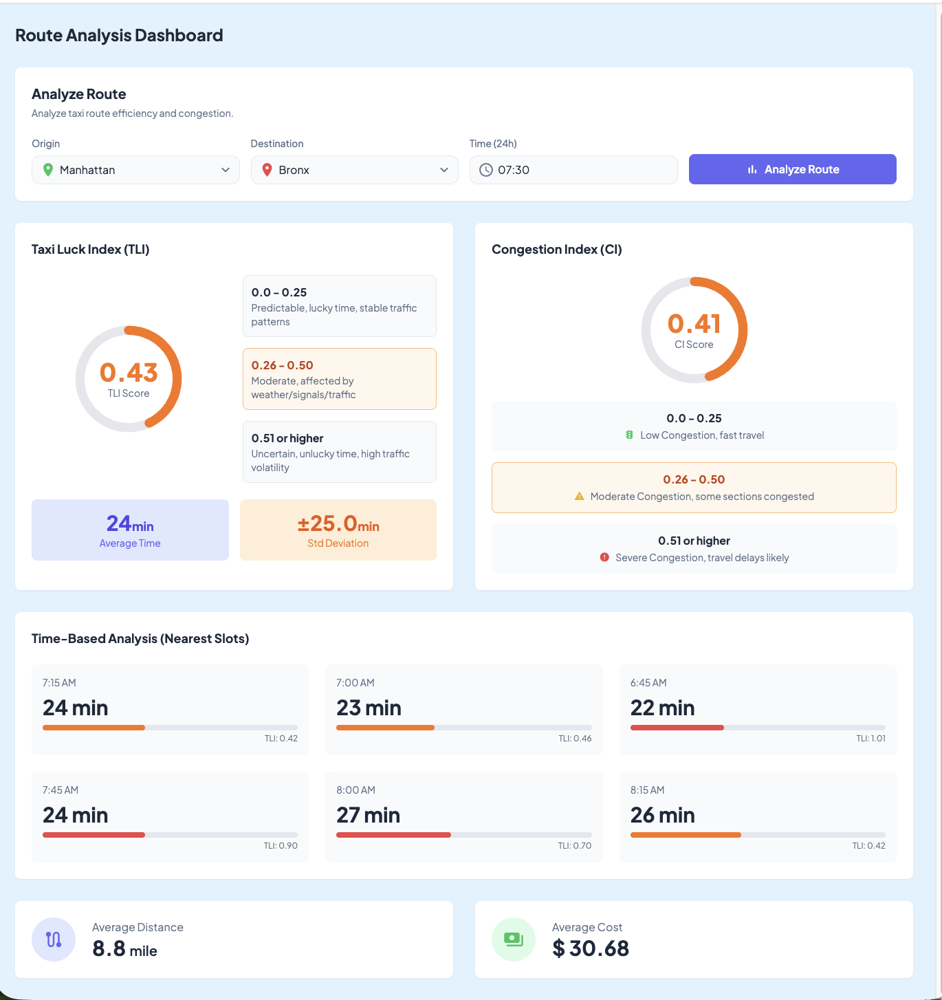

# Taxi Lucky Rate Dashboard

## 1. Project Overview

뉴욕시 택시가 움직이는 다섯 구역(Manhattan, Brooklyn, Queens, Bronx, Staten Island) 사이의 이동 상황을 시간대별로 보여주는 프로젝트입니다.  
사용자는 출발지와 도착지, 그리고 “몇 시에 이동할지”를 입력하면:

- 이동이 얼마나 순조로울지 나타내는 지수 **TLI (Taxi Luck Index)**
- 도로가 얼마나 붐비는지 나타내는 **CI (Congestion Index)**
- 예상 이동 시간, 이동 거리, 평균 요금  
  을 한 번에 확인할 수 있습니다. 결과는 백엔드(API)가 계산해 주고, 프런트엔드는 이를 보기 좋게 화면에 보여줍니다.

## 2. Motivation & Planning

- 문제 인식: 언제 택시를 타면 빠를지, 얼마나 막힐지 미리 알기 어렵습니다.
- 해결 목표: 시간대별 데이터로 “지금 가면 얼마나 걸릴까?”를 숫자로 알려주고, 더 좋은 시간대도 함께 제안합니다.
- 주요 사용자: 택시 승객, 기사, 차량 운영자, 교통·데이터 분석가.

## 3. Main Features

1. 경로·시간 분석
   - 출발/도착 구역과 시간을 넣으면 가장 가까운 데이터로 TLI, CI, 예상 시간·거리·비용을 계산해 줍니다.
2. 혼잡도 표시
   - 출발지와 도착지의 혼잡도를 합산·평균해 현재 붐빔 정도를 알려줍니다.
3. 인접 시간대 추천
   - 입력한 시간 앞뒤로 3개씩(최대 6개) 가까운 시간대도 함께 보여줘 “조금 더 일찍/늦게 가면 어떤지” 비교할 수 있습니다.

## 4. Tech Stack

- Backend: Python 3, Flask, pandas, numpy  
  (서버가 CSV 데이터를 읽어 계산합니다.)
- Data: `data/TLI_FINAL.csv`, `data/ci_final.csv` (시간대별 이동 지표가 담긴 파일)
- Frontend: React, TypeScript, Vite, Tailwind CDN  
  (API 결과를 웹 화면으로 보여주는 선택 사항)
- Tools: pip, npm

## 5. Program Structure

```text
taxi-lucky-rate-dashboard/
├─ api/               # Flask 백엔드 (app.py, requirements.txt)
├─ data/              # TLI_FINAL.csv, ci_final.csv 원본 데이터
├─ frontend/
│  └─ taxiluck-web/   # React + Vite 프런트엔드 소스
└─ README.md
```

## 6. How to Run

### A) 백엔드(API) 실행

1. Python 3 설치 후 아래를 순서대로 실행하세요.

```bash
cd api
python -m venv .venv && source .venv/bin/activate
pip install -r requirements.txt
# data/ 폴더에 TLI_FINAL.csv, ci_final.csv 가 있어야 합니다.
python app.py   # 기본 포트 5001
```

2. 서버가 켜진 후 브라우저에서 예시로 확인할 수 있습니다:  
   `http://127.0.0.1:5000/analyze?pu_borough=Manhattan&do_borough=Bronx&time=07:30`

### B) 프런트엔드 실행

1. Node.js가 있다면 다음을 실행하세요.

```bash
cd frontend/taxiluck-web
npm install
# API 주소를 바꾸려면 VITE_API_URL 환경변수로 지정 (기본: http://localhost:5001/analyze)
npm run dev   # http://localhost:5173 에서 확인
```

## 7. Execution Result

- Screenshot: `./assets/result.png` (대시보드 화면 예시)
- Demo Video: [YouTube 링크를 통해 확인할 수 있습니다`](https://youtu.be/9YO_kKrQfO4)



```text
project-root/
├─ assets/
│  ├─ result.png
│  └─ demo.mp4
```

## 8. Conclusion

이 프로젝트를 통해 “언제 이동하면 더 수월할지”를 숫자와 그래프로 쉽게 확인할 수 있습니다.
